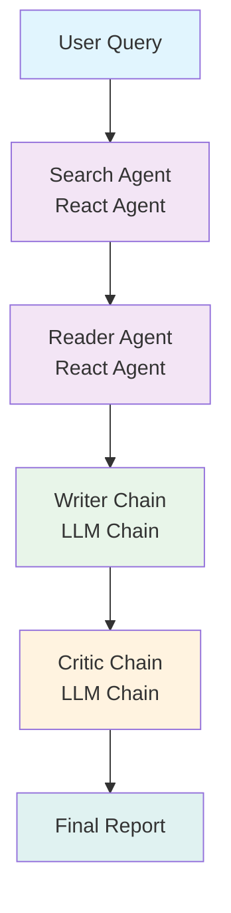

# Intellecta: Autonomous Multi-Agent Research Engine 🤖

[](https://www.python.org/downloads/)
[](LICENSE)
[](https://github.com/Vansh-Sharmaa/Multi-agent-research-system/actions/workflows/ci.yml)
[](https://github.com/Vansh-Sharmaa/Multi-agent-research-system/actions/workflows/codeql.yml)
[](https://codecov.io/gh/Vansh-Sharmaa/Multi-agent-research-system)
[](https://hub.docker.com/r/vanshsharmaa/intellecta-multi-agent)
[](https://intellecta.streamlit.app)
[](https://github.com/Vansh-Sharmaa/Multi-agent-research-system/stargazers)

> **Intellecta** is an advanced, local-first multi-agent AI engine designed to conduct deep web research on any given topic. By orchestrating a network of specialized AI agents built on **LangGraph** and **LangChain**, Intellecta searches the web, scrapes deep resources, compiles a comprehensive markdown report, and subjects it to a rigorous critical review—all powered locally and privately using **Ollama** and **Llama 3.1**.

The system features a polished, responsive user interface built using **Streamlit** that visually demonstrates the step-by-step pipeline execution in real time.

---

## 🏗️ System Architecture

### ResearchMind Flow Topology



### Agent Pipeline

| Stage | Agent | Technology | Responsibility |
|-------|-------|------------|----------------|
| 1 | **Search Agent** | React Agent + Tavily API | Locates 5 most relevant resources for the query |
| 2 | **Reader Agent** | React Agent + Browser | Scrapes, cleans, extracts core content (up to 3,000 chars) |
| 3 | **Writer Chain** | LLM Chain (Llama 3.1) | Consolidates findings into publication-ready markdown |
| 4 | **Critic Chain** | LLM Chain (Llama 3.1) | Evaluates quality, accuracy, depth → scores 1-10 |

---

## ⚡ Features

- 🔒 **Local & Private LLM Backend**: Powered by Ollama (`llama3.1` 8B) running entirely on your laptop. No expensive token fees or data privacy concerns.
- 🧠 **Stateful Multi-Agent Orchestration**: Built using **LangGraph** for clean, state-guided interaction boundaries between agents.
- 🎨 **Glassmorphism Streamlit UI**: Dark theme custom UI with interactive stage-cards indicating active state of each agent.
- ⚡ **CLI Alternative**: Quick CLI utility (`pipeline.py`) to run research from command line.
- 🔍 **Tavily Integration**: Clean search results tailored for agent workflows.
- 📊 **Self-Reflecting Quality Control**: Independent Critic agent ensures report quality before delivery.
- 🐳 **Docker Ready**: One-command deployment with all dependencies.
- 📈 **Comprehensive Logging**: Structured logs for debugging and monitoring.

---

## ⚙️ Installation & Setup

### Prerequisites

- Python 3.11+
- Ollama installed and running (`ollama serve`)
- Llama 3.1 model pulled (`ollama pull llama3.1:8b`)
- Tavily API key (free at [tavily.com](https://tavily.com))

### 1. Clone & Install Dependencies

```bash
git clone https://github.com/Vansh-Sharmaa/Multi-agent-research-system.git
cd Multi-agent-research-system
pip install -r requirements.txt
```

### 2. Configure Environment Variables

Create a `.env` file:

```bash
cp .env.example .env
```

Edit `.env` with your keys:

```env
TAVILY_API_KEY=your_tavily_api_key_here
OLLAMA_BASE_URL=http://localhost:11434
OLLAMA_MODEL=llama3.1:8b
STREAMLIT_SERVER_PORT=8501
```

### 3. Run the Application

**Streamlit UI (Recommended):**
```bash
streamlit run app.py
```
Then open http://localhost:8501

**CLI Mode:**
```bash
python pipeline.py "Your research topic here"
```

---

## 🐳 Docker Deployment

```bash
# Build
docker build -t intellecta-multi-agent .

# Run
docker run -p 8501:8501 \
  -e TAVILY_API_KEY=your_key \
  -v ~/.ollama:/root/.ollama \
  intellecta-multi-agent
```

Or pull from Docker Hub:
```bash
docker pull vanshsharmaa/intellecta-multi-agent:latest
```

---

## 📁 Project Structure

```
Multi-agent-research-system/
├── .github/workflows/ci.yml       # CI/CD Pipeline
├── agents.py                      # Agent definitions (Search, Reader, Writer, Critic)
├── app.py                         # Streamlit UI application
├── app_screenshot.png             # UI screenshot
├── architecture.svg               # Architecture diagram (SVG)
├── architecture_graph.svg         # Execution graph topology (SVG)
├── pipeline.py                    # CLI pipeline entrypoint
├── requirements.txt               # Python dependencies
├── tools.py                       # Custom tools (web search, scraping)
├── .env.example                   # Environment template
├── .gitignore
└── README.md
```

---

## 🔧 Configuration

### Agent Customization

Modify `agents.py` to customize:
- Search parameters (number of results, depth)
- Scraping behavior (timeout, max chars)
- LLM prompts for Writer/Critic
- Model selection (any Ollama-compatible model)

### UI Theming

The Streamlit UI uses custom CSS in `app.py`. Modify the `STYLES` constant for:
- Color scheme
- Stage card animations
- Typography

---

## 📊 Example Output

### Research Query: *"Impact of Quantum Computing on Cryptography"*

**Pipeline Execution:**
1. **Search Agent** → Finds 5 relevant papers/articles
2. **Reader Agent** → Deep scrapes top 3 sources
3. **Writer Chain** → Generates 2,500+ word report with citations
4. **Critic Chain** → Scores 8.5/10, identifies strengths & gaps

**Final Report Includes:**
- Executive summary
- Technical deep-dive
- Current state of post-quantum cryptography
- Timeline predictions
- References with links

---

## 🧪 Testing

```bash
# Run all tests with coverage
pytest --cov=. --cov-report=html

# Run specific test file
pytest tests/test_agents.py -v
```

---

## 🤝 Contributing

1. Fork the repository
2. Create feature branch (`git checkout -b feature/amazing-feature`)
3. Commit changes (`git commit -m 'feat: add amazing feature'`)
4. Push to branch (`git push origin feature/amazing-feature`)
5. Open Pull Request

---

## 📄 License

MIT License - see [LICENSE](LICENSE) for details.

---

## 👨‍💻 Author

**Vansh Sharma** - AI/ML Engineer | NLP | GenAI | LLMs

[](https://github.com/Vansh-Sharmaa)
[](https://linkedin.com/in/vnxsh)
[](mailto:engagevansh@gmail.com)

---

## 🙏 Acknowledgments

- [LangGraph](https://github.com/langchain-ai/langgraph) - Multi-agent orchestration
- [LangChain](https://github.com/langchain-ai/langchain) - LLM application framework
- [Ollama](https://ollama.ai/) - Local LLM runtime
- [Tavily](https://tavily.com/) - Search API for agents
- [Streamlit](https://streamlit.io/) - Web app framework

---

⭐ **Star this repo if you find it useful!** ⭐