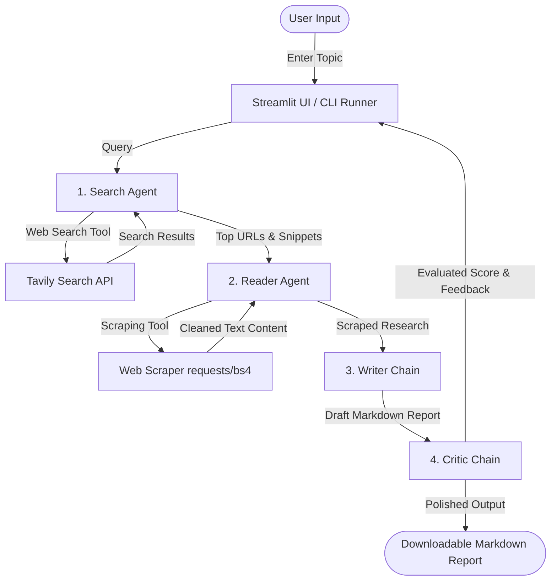

# ResearchMind: Multi-Agent AI Research System

<p align="center">
  
</p>

ResearchMind is an advanced, local-first multi-agent AI application designed to conduct deep web research on any given topic. By orchestrating a network of specialized AI agents built on **LangGraph** and **LangChain**, ResearchMind searches the web, scrapes deep resources, compiles a comprehensive markdown report, and subjects it to a rigorous critical review—all powered locally and privately using **Ollama** and **Llama 3.1**.

The system features a polished, responsive user interface built using **Streamlit** that visually demonstrates the step-by-step pipeline execution in real time.

---

## 🏗️ System Architecture

ResearchMind uses a decentralized, cooperative multi-agent architecture where agents communicate and pass state between execution stages:



1. **Search Agent (React Agent)**: Uses a search engine API to locate the 5 most relevant resources for the query.
2. **Reader Agent (React Agent)**: Selects the most promising link and programmatically scrapes, cleans, and extracts its core contents (up to 3,000 characters).
3. **Writer Chain (LLM Chain)**: Consolidates the web search findings and deep-scraped details into a beautifully formatted, publication-ready markdown report.
4. **Critic Chain (LLM Chain)**: Evaluates the report strictly on quality, accuracy, and depth, returning a numerical score (e.g. 8/10), a list of strengths, and areas to improve.

---

## ⚡ Features

- **Local & Private LLM Backend**: Powered by Ollama (`llama3.1` 8B) running entirely on your laptop. No expensive token fees or data privacy concerns for core processing.
- **Stateful Multi-Agent Orchestration**: Built using **LangGraph** to construct clean, state-guided interaction boundaries between agents.
- **Glassmorphism Streamlit UI**: A state-of-the-art dark theme custom UI with interactive stage-cards indicating the active state of each agent.
- **CLI Alternative**: A quick CLI utility (`pipeline.py`) to run research straight from your command line.
- **Tavily Integration**: Clean search results tailored for agent workflows.
- **Self-Reflecting Quality Control**: An independent Critic agent ensures report quality meets standards before delivery.

---

## ⚙️ Installation & Setup

### 1. Clone & Install Dependencies
Ensure you have Python 3.10+ installed.

```bash
git clone https://github.com/yourusername/multi-agent-research-system.git
cd multi-agent-research-system
pip install -r requirements.txt
```

### 2. Configure Environment Variables
Create a `.env` file in the root directory and add your Tavily API Key:

```env
TAVILY_API_KEY="your_tavily_api_key_here"
```
*(Get a free Tavily search API key at [tavily.com](https://tavily.com)).*

### 3. Setup Local LLM (Ollama)
ResearchMind runs Llama 3.1 locally for agent thinking and report generation.

1. Download and install Ollama from [ollama.com](https://ollama.com/).
2. Pull the Llama 3.1 model by running this in your terminal:
   ```bash
   ollama run llama3.1
   ```
3. Keep the Ollama application open or run `ollama serve` in the background.

---

## 🚀 Running the Application

### Option A: Polished GUI (Streamlit Web App)
To launch the interactive, animated web portal:

```bash
streamlit run app.py
```
Open **`http://localhost:8501`** in your browser.

### Option B: Terminal CLI
To run a fast research query directly in your console:

```bash
python pipeline.py
```

---

## 🛠️ Technology Stack

- **Framework**: LangGraph & LangChain (Agentic orchestration)
- **Local Model Manager**: Ollama
- **Local LLM**: Llama 3.1 (8B Parameters)
- **Frontend**: Streamlit
- **Search Tool**: Tavily Search Engine API
- **Web Scraping**: BeautifulSoup4 & Requests
- **Logging & Terminal Output**: Rich
