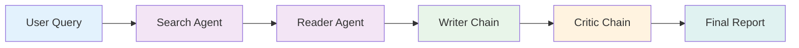

# Architecture Overview

## System Design

Intellecta follows a **pipeline architecture** with four specialized agents connected via LangGraph state management.



## State Management

LangGraph maintains a typed state object passed between agents:

```python
class ResearchState(TypedDict):
    query: str
    search_results: List[SearchResult]
    scraped_content: List[ScrapedContent]
    draft_report: str
    critic_feedback: CriticFeedback
    final_report: str
    iteration: int
```

## Agent Details

### 1. Search Agent (React Agent)
- **Tool**: Tavily Search API
- **Output**: Top 5 relevant URLs with snippets
- **Config**: Recency, domain filtering, result count

### 2. Reader Agent (React Agent)
- **Tool**: Web scraping (requests + BeautifulSoup)
- **Output**: Cleaned content (max 3000 chars per source)
- **Config**: Timeout, user-agent, content selectors

### 3. Writer Chain (LLM Chain)
- **Model**: Ollama (Llama 3.1)
- **Prompt**: Structured report generation with citations
- **Output**: Markdown report

### 4. Critic Chain (LLM Chain)
- **Model**: Ollama (Llama 3.1)
- **Prompt**: Quality evaluation rubric
- **Output**: Score (1-10), strengths, improvements