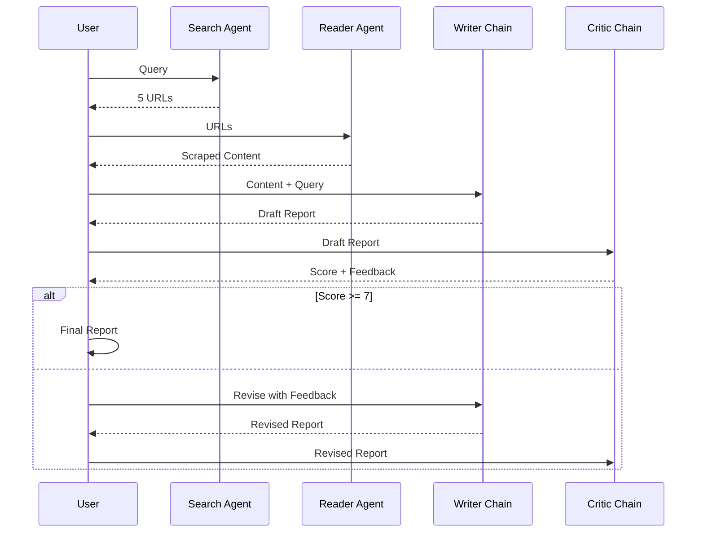

# Pipeline

## Execution Flow

The research pipeline executes in sequential stages with state passed between each.



## State Transitions

```python
# Simplified pipeline logic
async def run_pipeline(query: str) -> ResearchState:
    state = ResearchState(query=query, iteration=0)
    
    # Stage 1: Search
    state["search_results"] = await search_agent.ainvoke(state)
    
    # Stage 2: Read
    state["scraped_content"] = await reader_agent.ainvoke(state)
    
    # Stage 3: Write
    state["draft_report"] = await writer_chain.ainvoke(state)
    
    # Stage 4: Critique (with revision loop)
    while state["iteration"] < MAX_ITERATIONS:
        state["critic_feedback"] = await critic_chain.ainvoke(state)
        if state["critic_feedback"]["pass"]:
            state["final_report"] = state["draft_report"]
            break
        state["draft_report"] = await writer_chain.ainvoke(state, feedback=state["critic_feedback"])
        state["iteration"] += 1
    
    return state
```

## Error Handling

| Stage | Failure Mode | Recovery |
|-------|--------------|----------|
| Search | API timeout/rate limit | Retry with exponential backoff |
| Read | Connection error/404 | Skip URL, continue with others |
| Write | LLM error/timeout | Retry once, use fallback template |
| Critic | LLM error/timeout | Accept draft, log warning |

## Configuration

```python
# pipeline.py
MAX_ITERATIONS = 2
SEARCH_MAX_RESULTS = 5
READER_MAX_CHARS = 3000
CRITIC_PASS_THRESHOLD = 7.0
```